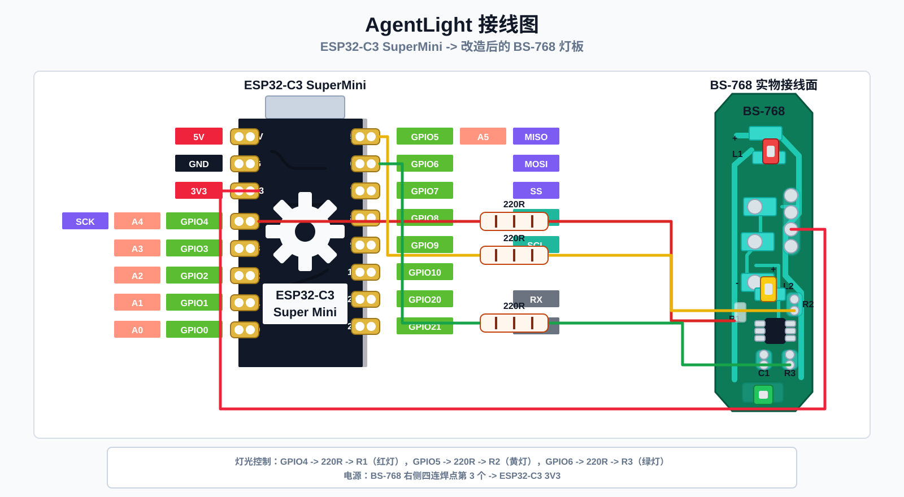

<p align="center">
  
</p>

<h1 align="center">微信消息指示灯 · AgentLight</h1>

<p align="center">
  基于 ESP32-C3 的个人桌面微信消息红黄绿灯。
</p>

<p align="center">
  微信消息监听 · USB 串口控制 · Bluetooth LE 控制 · Wi-Fi HTTP 控制
</p>

[简体中文](./README.md) | [English](./README.en.md)

# AgentLight

AgentLight 是一个基于 ESP32-C3 的个人微信桌面消息指示灯项目。电脑端服务监听 macOS / Windows 桌面微信的可观察消息信号，将普通消息、重要消息、清除、离线和监听异常映射为红 / 黄 / 绿灯效，再通过 USB、系统蓝牙或 Wi-Fi HTTP 下发到硬件。

当前仓库包含：

- **ESP32-C3 固件**：接收灯光命令并控制红 / 黄 / 绿灯。
- **硬件命令桥**：`scripts/agentlight` 通过 USB、BLE 或 HTTP 向设备发送命令。
- **微信消息服务**：`scripts/agentlight-wechat` 运行本机微信监听 helper、规则引擎和灯效状态机。
- **macOS / Windows helper**：各自负责观察本机微信状态并输出统一 JSONL 事件。

完整使用说明见 [docs/user-guide.md](./docs/user-guide.md)。

## 硬件

- ESP32-C3 SuperMini
- BS-768 玩具红 / 黄 / 绿灯小板
- 每一路灯珠控制线单独串联 220R 电阻

默认接线：



| 连接点 | ESP32-C3 引脚 | 接法 |
| --- | --- | --- |
| 公共正极 | 3V3 | `3V3` -> 小板公共 `+` |
| 公共负极 | GND | `GND` -> 小板 `-` |
| 红灯控制端 | GPIO4 | `GPIO4` -> 220R -> 红灯控制脚 |
| 黄灯控制端 | GPIO5 | `GPIO5` -> 220R -> 黄灯控制脚 |
| 绿灯控制端 | GPIO6 | `GPIO6` -> 220R -> 绿灯控制脚 |

## 固件命令

命令协议使用纯文本，一次发送一条命令：

| 命令 | 结果 |
| --- | --- |
| `GREEN` | 绿灯亮 |
| `YELLOW_BLINK` | 黄灯闪烁 |
| `RED_BLINK` | 红灯闪烁 |
| `RED` | 红灯常亮 |
| `OFF` | 全部熄灭 |
| `ALL` | 红 / 黄 / 绿三路同时常亮 |
| `PING` | 返回 `PONG` |
| `STATUS` | 返回当前灯光状态 |

完整命令还包括 `GREEN_BREATHE`、`GREEN_BLINK`、`YELLOW`、`YELLOW_BREATHE`、`RED_BREATHE`、`ALL_BLINK`、`ALL_BREATHE` 和 `HELP`。

## 硬件命令桥

```bash
scripts/agentlight status
scripts/agentlight green
scripts/agentlight yellow-blink
scripts/agentlight red-blink
```

默认 `AGENTLIGHT_TRANSPORT=auto`：检测到 USB 串口时走 USB；没有 USB 串口时走系统蓝牙。也可以显式指定：

```bash
AGENTLIGHT_TRANSPORT=usb scripts/agentlight status
AGENTLIGHT_TRANSPORT=ble-system scripts/agentlight yellow-blink
AGENTLIGHT_TRANSPORT=http AGENTLIGHT_BASE_URL=http://192.168.4.1 scripts/agentlight red-blink
```

## 微信消息服务

示例配置在 [config/wechat-agentlight.example.json](./config/wechat-agentlight.example.json)。

前台检查：

```bash
scripts/agentlight-wechat check-config
scripts/agentlight-wechat doctor
scripts/agentlight-wechat once
```

用 fake helper 验证完整链路，不需要真实微信账号：

```bash
python3 - <<'PY'
import json
from pathlib import Path

config = json.loads(Path("config/wechat-agentlight.example.json").read_text())
config["sendToHardware"] = False
config["helperCommand"] = ["scripts/agentlight-wechat-fake-helper", "message"]
Path("/tmp/wechat-agentlight-test.json").write_text(json.dumps(config))
PY

scripts/agentlight-wechat once --config /tmp/wechat-agentlight-test.json
```

事件到灯效的默认映射：

| 微信状态 / 事件 | 灯效 | 含义 |
| --- | --- | --- |
| 无未读消息 / 已读清空 | `OFF` | 全部熄灭 |
| 普通新消息刚到达 | `YELLOW_BLINK` | 黄灯闪烁，提示有新消息 |
| 普通消息仍未读 | `YELLOW_BREATHE` | 黄灯呼吸，表示还有未读消息 |
| 重要新消息刚到达 | `RED_BLINK` | 红灯闪烁，提示重要消息 |
| 重要消息仍未读 | `RED_BREATHE` | 红灯呼吸，表示重要消息还未处理 |
| 免打扰新消息刚到达 | `GREEN_BLINK` | 绿灯闪烁，低优先级提示 |
| 免打扰消息仍未读 | `GREEN_BREATHE` | 绿灯呼吸，表示只有免打扰未读 |
| 微信未运行 / 离线 | `OFF` | 全部熄灭 |
| 微信监听异常 / 权限异常 | `RED` | 红灯常亮，表示服务异常 |

默认闪烁持续 `10` 秒；10 秒后仍未读，会切换到对应呼吸灯效。已读或未读清空会立即 `OFF`。呼吸状态会每 `30` 秒重发一次当前灯效，避免硬件被手动命令改乱后长期停在错误状态。macOS 只能读到 `unread-only` 弱信号时，会每 `30` 秒重新闪烁一次，再回到呼吸。

## 平台能力

macOS 使用 Swift helper 和 Accessibility API 观察微信进程、未读状态、窗口标题和可见摘要。微信版本或权限限制导致内容不可读时，会降级为普通未读提醒。

Windows 使用 helper 通过 UI Automation 观察微信窗口的可见未读状态和可见摘要；权限或 UI 结构不可用时会输出诊断。

项目默认不注入微信进程、不解密微信数据库、不读取完整聊天历史、不做自动回复。

## 构建与烧录

```bash
pio run -e esp32-c3-supermini
pio run -e esp32-c3-supermini -t upload
pio device monitor
```

烧录后可以直接验收：

```bash
scripts/agentlight status
scripts/agentlight yellow-blink
scripts/agentlight red-blink
scripts/agentlight green
```

## 架构

```text
AgentLight/
├── src/                         ESP32-C3 固件
├── include/                     固件头文件
├── agentlight_wechat/           微信消息服务领域、应用、基础设施和 CLI
├── desktop/
│   ├── macos/                   macOS 蓝牙 helper 和微信观察 helper
│   └── windows/                 Windows 微信观察 helper
├── scripts/
│   ├── agentlight               硬件命令桥
│   ├── agentlight-wechat        微信消息服务入口
│   ├── agentlight-wechat-event  JSONL 微信事件生成工具
│   ├── agentlight-wechat-gate   单事件灯效映射工具
│   └── agentlight-wechat-fake-helper
├── config/
│   └── wechat-agentlight.example.json
├── service/                     macOS / Windows 后台服务安装脚本
├── tests/                       微信业务和硬件桥测试
└── docs/                        使用说明和设计文档
```

## 开源协议

AgentLight 使用 [MIT License](./LICENSE) 开源，SPDX 标识为 `MIT`。
