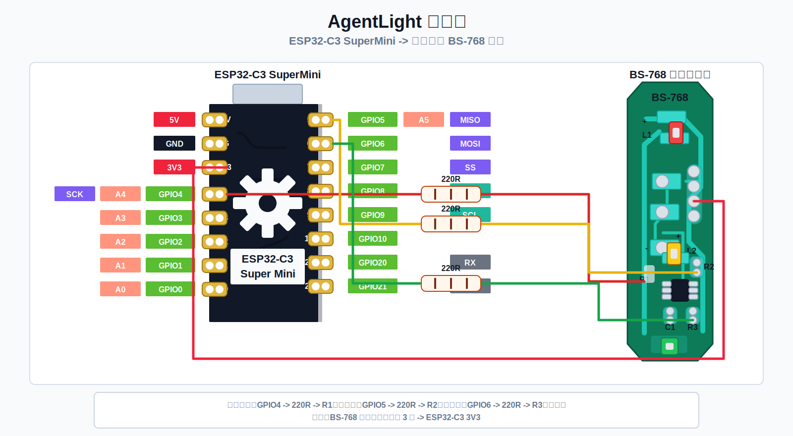
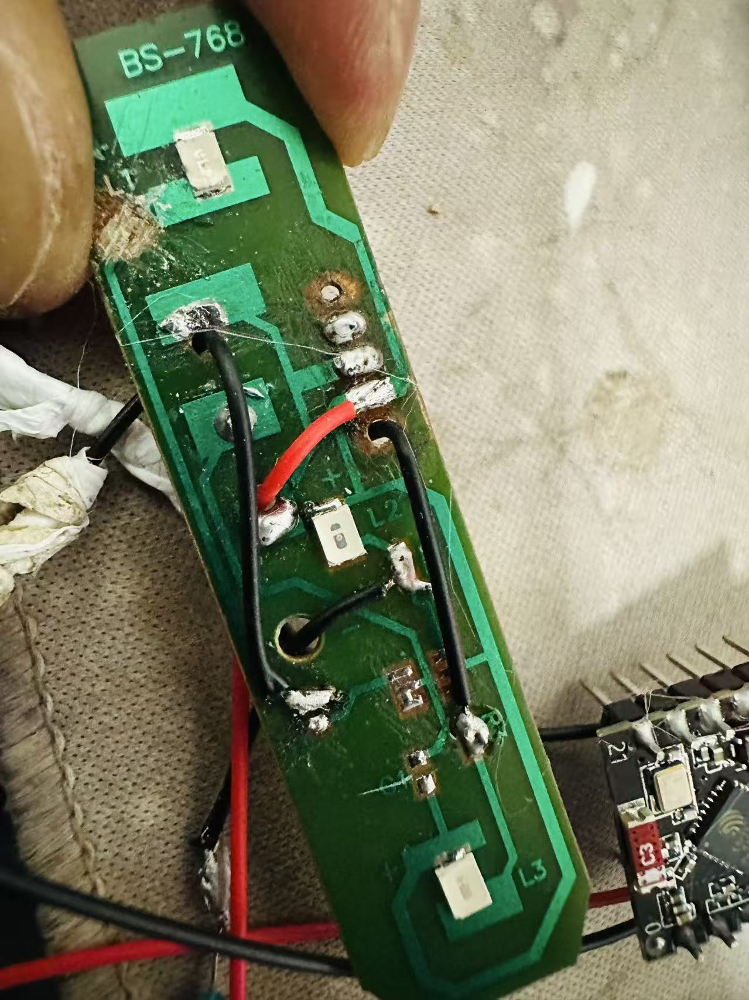
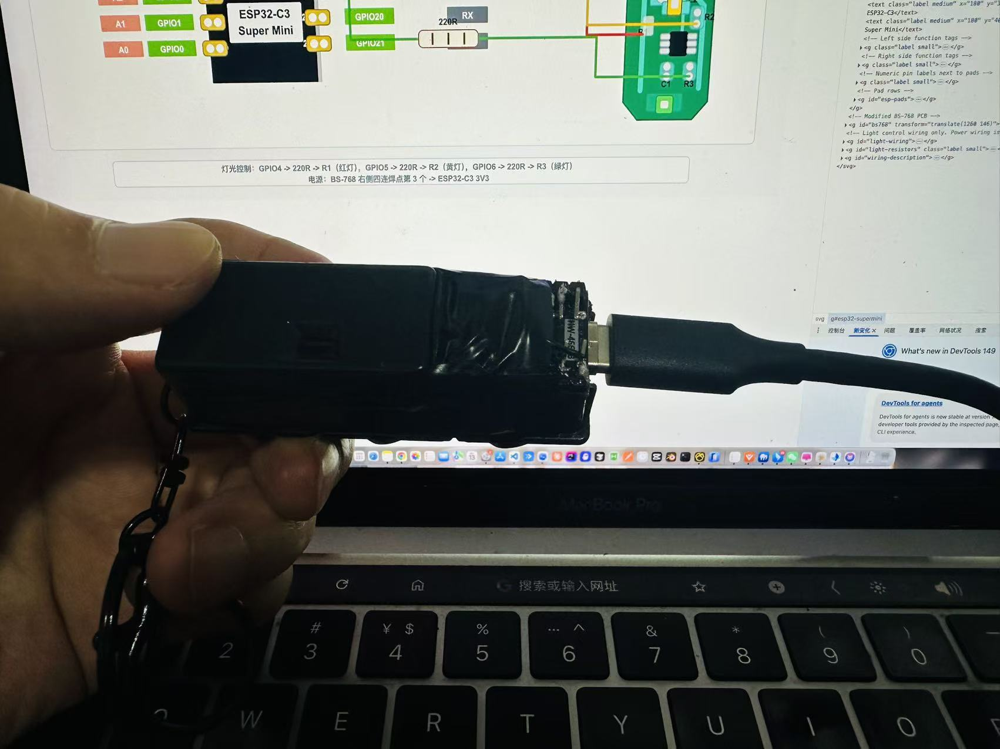

# AgentLight 使用说明

本文档面向第一次使用 AgentLight 的用户，按实际落地顺序说明硬件接线、固件烧录、设备验证、后台服务启动和 AI 工具接入。

## 使用流程

```text
准备硬件
  -> 接线
  -> 构建并烧录固件
  -> 验证 USB / BLE / Wi-Fi 控制
  -> 配置电脑端 Agent 服务
  -> 启动后台服务
  -> 接入 Codex 或其他 AI 工具
  -> 查看日志和排查问题
```

## 准备硬件

需要准备：

| 物料 | 说明 |
| --- | --- |
| ESP32-C3 SuperMini | 当前固件目标开发板 |
| BS-768 玩具红绿灯小板 | 拆掉原控制 / 限流元件后，只保留灯珠和走线 |
| 220R 电阻 | 每一路 GPIO 到灯珠控制脚都需要单独串联 |
| USB 数据线 | 必须支持数据传输，不能只支持充电 |

默认接线：



| 连接点 | ESP32-C3 引脚 | 接法 |
| --- | --- | --- |
| 公共正极 | 3V3 | `3V3` -> 小板公共 `+` |
| 公共负极 | GND | `GND` -> 小板 `-` |
| 红灯控制端 | GPIO4 | `GPIO4` -> 220R -> 红灯控制脚 |
| 黄灯控制端 | GPIO5 | `GPIO5` -> 220R -> 黄灯控制脚 |
| 绿灯控制端 | GPIO6 | `GPIO6` -> 220R -> 绿灯控制脚 |

BS-768 小板按共阳方式控制，固件默认已经设置 `AGENTLIGHT_ACTIVE_LOW=1`。GPIO 拉低时对应灯亮，GPIO 拉高时对应灯灭。当前小板只作为灯珠载板使用，原限流 / 控制元件已拆除，所以每一路 GPIO 到灯珠控制脚都必须串联 220R。

实物参考：





## 构建并烧录固件

安装 PlatformIO 后，在仓库根目录执行：

```bash
pio run -e esp32-c3-supermini
pio run -e esp32-c3-supermini -t upload
pio device monitor
```

烧录成功后，固件会同时开启：

| 通道 | 用途 |
| --- | --- |
| USB Serial | 通过串口发送文本命令 |
| Bluetooth LE | 系统蓝牙连接后通过 HID 命令报告发送文本命令；调试时也可写入 BLE RX 特征 |
| Wi-Fi HTTP | 电脑连接设备 AP 后通过 HTTP API 发送命令 |

默认固件配置：

| 配置 | 默认值 |
| --- | --- |
| BLE 设备名 | `WHALESKY-LABS-AGENTLIGHT` |
| BLE 广播短名称 | `AGENTLIGHT` |
| BLE 配对 | 默认启用 |
| BLE 配对码 | `123456` |
| Wi-Fi AP | `WHALESKY-LABS-AGENTLIGHT` |
| Wi-Fi 密码 | `12345678` |
| HTTP 地址 | `http://192.168.4.1` |

## 验证硬件

### 使用 Wi-Fi HTTP 验证

1. 电脑连接 Wi-Fi：`WHALESKY-LABS-AGENTLIGHT`
2. 密码输入：`12345678`
3. 执行命令：

```bash
curl "http://192.168.4.1/status"
curl "http://192.168.4.1/command?cmd=GREEN"
curl "http://192.168.4.1/command?cmd=YELLOW_BLINK"
curl "http://192.168.4.1/command?cmd=RED_BLINK"
curl "http://192.168.4.1/command?cmd=ALL"
```

如果灯能按命令切换，说明硬件、固件和 Wi-Fi 控制通道已经可用。

### 使用 USB Serial 验证

打开串口监视器：

```bash
pio device monitor
```

在串口中输入：

```text
GREEN
YELLOW_BLINK
RED_BLINK
ALL
STATUS
```

每条命令以换行结尾。成功时固件会返回 `OK <STATE>` 或 `STATUS <STATE>`。
`ALL` 会让红 / 黄 / 绿三路同时常亮，适合排查灯珠、飞线和焊点。
上电后固件会先执行启动自检：红灯、黄灯、绿灯依次点亮，然后三灯同时闪烁 3 次，表示初始化完成。

### 使用 BLE 验证

BLE 默认启用配对 / 绑定。ESP32-C3 使用的是 BLE 连接，不是经典蓝牙串口 SPP，也不是键盘 / 鼠标 / 音频设备。

用户只通过电脑系统蓝牙连接或断开 AgentLight：

1. 打开电脑系统蓝牙设置。
2. 找到设备 `AGENTLIGHT`。
3. 点击连接或配对。
4. 如果系统要求配对码，输入 `123456`。
5. 断开时也在系统蓝牙设置中操作。

说明：固件会发布标准 HID Presentation Remote 外观，让电脑系统蓝牙列表更稳定地展示设备。系统蓝牙命令通过 HID vendor feature report 发送到已连接设备；通用 BLE 调试客户端仍可使用 AgentLight 自定义 RX / TX GATT 服务。固件不会发送任何键盘或鼠标输入事件。

需要验证命令通道时，可以在系统蓝牙已经连接后使用桥接脚本：

```bash
AGENTLIGHT_TRANSPORT=ble-system scripts/agentlight status
AGENTLIGHT_TRANSPORT=ble-system scripts/agentlight yellow-blink
```

`ble-system` 只使用系统已经连接的 AgentLight 设备，并通过 HID vendor feature report 发送命令。没有连接时会返回 `SKIP BLE_NOT_CONNECTED`，不会主动扫描、连接或重连。

BLE 生命周期验收标准：

1. 系统蓝牙已连接时，`ble-system` 命令返回 `OK <STATE>` 或 `STATUS <STATE>`。
2. 用户在系统蓝牙里手动断开后，固件立即进入 `OFF`。
3. 断开后再次执行 `ble-system` 命令，应返回 `SKIP BLE_NOT_CONNECTED`，后台服务不得主动扫描、连接或重连。
4. 固件不会在断开后自动恢复可连接广播。
5. 长按 ESP32-C3 板载 `BOOT` 键 2 秒后，系统蓝牙列表应重新出现可连接入口，窗口持续 60 秒。
6. 用户手动重新连接后，`ble-system` 命令恢复可用。
7. USB 连接电脑时，固件进入 USB 模式，主动挂起 BLE 广播、断开已连接的 BLE 客户端，并拒收 BLE 命令。
8. 拔掉 USB 后，固件进入蓝牙模式，并打开一次 60 秒手动连接窗口。

特征 UUID：

| 特征 | UUID | 说明 |
| --- | --- | --- |
| RX | `8f16d7a1-6c6d-4d68-8d64-6b4d2a86b601` | 写入命令 |
| TX | `8f16d7a2-6c6d-4d68-8d64-6b4d2a86b601` | 读取 / 通知响应 |

### 使用桥接脚本验证

桥接脚本默认使用自动通道选择：检测到 USB 串口时走 USB；没有 USB 串口时走系统蓝牙。固件侧也会根据 USB 主机连接状态在 USB 模式和蓝牙模式之间切换。

```bash
scripts/agentlight status
scripts/agentlight green
scripts/agentlight yellow-blink
scripts/agentlight red-blink
```

通过 USB 串口控制时：

```bash
AGENTLIGHT_TRANSPORT=usb scripts/agentlight status
AGENTLIGHT_TRANSPORT=usb scripts/agentlight yellow-blink
```

默认会自动发现 `/dev/cu.usbmodem*` 等常见 USB 串口。换 USB 口后 macOS 可能分配新的串口名，保持 `AGENTLIGHT_SERIAL_PORT` 为空即可自动适配；如果同时连接多块设备，再手动指定具体端口。

通过系统蓝牙控制时，先在电脑系统蓝牙里连接 `AGENTLIGHT`：

```bash
AGENTLIGHT_TRANSPORT=ble-system scripts/agentlight status
AGENTLIGHT_TRANSPORT=ble-system scripts/agentlight yellow-blink
```

如果设备地址不是默认值，可以设置：

```bash
export AGENTLIGHT_BASE_URL="http://192.168.4.1"
```

## 启动电脑端后台服务

电脑端后台服务负责监听 AI 工具状态，并把状态事件发送到硬件。用户连接或断开蓝牙时，只使用电脑系统蓝牙设置；后台服务不提供本地网页控制入口，也不会在用户断开后主动重新连接。

默认配置文件是 [config/agentlight-agent.example.json](../config/agentlight-agent.example.json)：

```json
{
  "activePlatform": "codex",
  "multiSessionMode": "latest-event-wins",
  "sendToHardware": true,
  "environment": {
    "AGENTLIGHT_TRANSPORT": "auto",
    "AGENTLIGHT_SERIAL_PORT": "",
    "AGENTLIGHT_SERIAL_BAUD": "115200",
    "AGENTLIGHT_HOST": "192.168.4.1",
    "AGENTLIGHT_TIMEOUT": "2"
  }
}
```

关键规则：

- 服务启动时只监听一个 `activePlatform`。
- 多会话策略固定为 `latest-event-wins`。
- 同一平台内哪个会话最后产生状态事件，硬件灯就显示哪个会话的状态。
- `sendToHardware=true` 时，事件会继续发送到硬件；测试监听时可以先改成 `false`。
- 默认 `AGENTLIGHT_TRANSPORT=auto`：检测到 USB 串口时走 USB；拔掉 USB 后自动走系统蓝牙。
- USB 连接电脑时，固件进入 USB 模式，主动挂起 BLE 广播、断开已连接的 BLE 客户端，并拒收 BLE 命令，避免系统蓝牙自动连接 / 断开干扰 USB 工作状态。
- 需要走系统蓝牙时，先在系统蓝牙设置中连接 `AGENTLIGHT`；服务只向已连接设备发送 HID 命令报告，不接管蓝牙连接。断开后不会自动重连，灯光进入 `OFF`，固件关闭可连接广播。需要重新连接时，长按 ESP32-C3 板载 `BOOT` 键 2 秒，打开 60 秒手动连接窗口。
- 服务入口会按当前平台配置启动 `scripts/multi-agent-monitor --config <monitor-config> --platform <activePlatform> --send`。
- 如果监听器退出，后台服务会按配置等待后重新启动监听器。

### 前台试运行

先用前台模式确认配置没问题：

```bash
scripts/agentlight-agent check-config --config config/agentlight-agent.example.json
scripts/agentlight-agent print-runtime --config config/agentlight-agent.example.json
scripts/agentlight-agent run --config config/agentlight-agent.example.json
```

如果只想看 Codex 状态能否被监听，不控制硬件，可以直接运行：

```bash
scripts/codex-session-monitor --once --limit 20
```

### macOS 后台服务

安装 LaunchAgent：

```bash
service/macos/install-launch-agent.sh
```

默认配置位置：

```text
~/.whalesky-labs-AgentLight/agentlight-agent.json
```

默认日志位置：

```text
~/Library/Logs/whalesky-labs-AgentLight/
```

安装脚本会创建项目专用 Python 环境并安装 `requirements.txt`，同时构建 macOS 蓝牙命令 helper。

查看服务：

```bash
launchctl list | grep whalesky-labs
tail -f ~/Library/Logs/whalesky-labs-AgentLight/agentlight-agent.log
tail -f ~/Library/Logs/whalesky-labs-AgentLight/launchagent.err.log
```

卸载：

```bash
service/macos/uninstall-launch-agent.sh
```

### Windows 后台服务

以管理员身份打开 PowerShell：

```powershell
Set-ExecutionPolicy -Scope Process Bypass
python -m pip install -r requirements.txt
.\service\windows\install-service.ps1
```

默认服务名：

```text
whalesky-labs-AgentLight
```

默认配置位置：

```text
%ProgramData%\whalesky-labs-AgentLight\agentlight-agent.json
```

默认日志目录：

```text
%ProgramData%\whalesky-labs-AgentLight\logs\
```

常用命令：

```powershell
Get-Service whalesky-labs-AgentLight
Start-Service whalesky-labs-AgentLight
Stop-Service whalesky-labs-AgentLight
.\service\windows\uninstall-service.ps1
```

## 切换 AI 平台

查看当前平台：

```bash
scripts/agentlight-agent platform get --config config/agentlight-agent.example.json
```

查看可用平台：

```bash
scripts/agentlight-agent platform list --config config/agentlight-agent.example.json
```

切换到 Codex：

```bash
scripts/agentlight-agent platform set codex --config config/agentlight-agent.example.json
```

切换平台后，需要重启后台服务，让新平台配置生效。

## 接入 AI 工具

统一事件入口：

```bash
scripts/agentlight-event --agent <agent> --event <event> --send
```

常用事件：

| 事件 | 灯光状态 |
| --- | --- |
| `start` | `YELLOW_BLINK` |
| `tool` | `YELLOW_BLINK` |
| `thinking` | `YELLOW_BREATHE` |
| `done` | `GREEN_BLINK` -> `GREEN` |
| `waiting` | `RED_BLINK` |
| `error` | `RED` |
| `idle` | `GREEN` |

灯效时序：

| 灯效 | 固件行为 |
| --- | --- |
| 启动自检 | 上电后红灯、黄灯、绿灯依次点亮，再三灯同时闪烁 3 次 |
| 常亮 | 目标颜色持续点亮，其他颜色熄灭 |
| 闪烁 | 默认 800ms 周期，亮 400ms / 灭 400ms |
| `YELLOW_BLINK` | 400ms 周期，亮 200ms / 灭 200ms |
| 呼吸 | 2000ms 周期，亮度从低到高再回落 |

Codex 推荐先使用本地 session 监听：

```bash
scripts/codex-session-monitor --thread-id "$CODEX_THREAD_ID" --from-start
scripts/codex-session-monitor --thread-id "$CODEX_THREAD_ID" --event-command scripts/agentlight-event
```

其他平台可以先使用通用 wrapper：

```bash
/absolute/path/to/AgentLight/hooks/agents/generic-wrapper.sh <agent> <command> "$@"
```

不同平台的具体接入说明见：

- [hooks/agents/README.md](../hooks/agents/README.md)
- [hooks/codex/README.md](../hooks/codex/README.md)
- [hooks/cursor/README.md](../hooks/cursor/README.md)
- [config/agent-platforms.json](../config/agent-platforms.json)

## 常见问题

### Wi-Fi 连接后没有响应

- 确认电脑连接的是 `WHALESKY-LABS-AGENTLIGHT`。
- 确认请求地址是 `http://192.168.4.1`。
- 确认固件已经烧录成功，并且开发板已重新上电。

### 灯不亮

- 检查 `3V3` 是否接到小板公共 `+`，`GND` 是否接到小板 `-`。
- 检查 GPIO 到每一路灯珠控制脚之间是否串联了 220R。
- 检查固件是否使用 `AGENTLIGHT_ACTIVE_LOW=1`。
- 用 `GREEN`、`YELLOW_BLINK`、`RED_BLINK` 分别测试三路。
- 用 `ALL` 进行全亮自检，确认红 / 黄 / 绿三路线路都能同时点亮。

### 服务启动了但灯没有变化

- 先运行 `scripts/agentlight yellow-blink`，确认硬件通道可用。
- 查看服务配置中的 `sendToHardware` 是否为 `true`。
- 查看 `AGENTLIGHT_HOST` 或 `AGENTLIGHT_BASE_URL` 是否指向正确设备。
- 查看后台服务日志，确认监听器是否有事件输出。

### Codex 状态没有被监听到

- 确认 Codex 已经产生本地 session JSONL。
- 先运行 `scripts/codex-session-monitor --once --limit 20` 看是否有输出。
- 如果要限制到某个会话，确认 `CODEX_THREAD_ID` 是否正确。

## 项目边界

AgentLight 只负责把可观察到的 AI Agent 状态同步到硬件红黄绿灯。

当前不提供：

- 桌面 GUI 客户端
- 托盘面板
- Dashboard
- 权限气泡
- 终端聚焦
- 自动改写第三方 AI 工具配置
